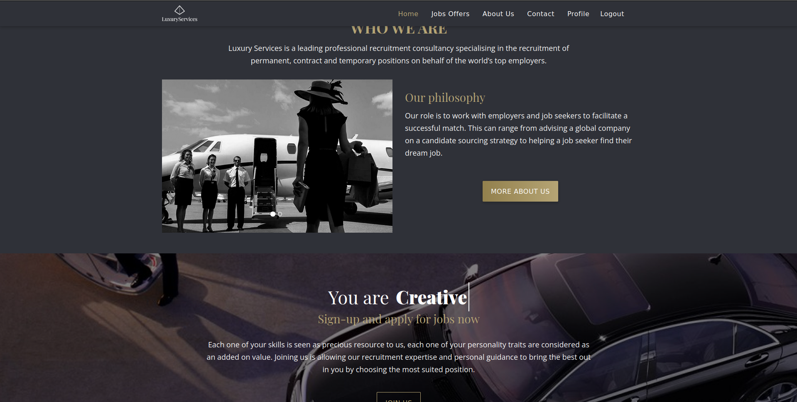

<h1>Luxury</h1> 

Luxury est une plateforme développée avec Symfony pour connecter les talents aux opportunités d'emploi de luxe. Elle offre des fonctionnalités d'inscription, de connexion sécurisée, et de recherche avancée d'offres d'emploi.
 

<h2>🚀 Démo</h2> 

Le projet est déployé et accessible en ligne : <a href="https://nadir-luxury.pro4.garage404.com/" target="_blank">Accéder à Luxury</a>
 

<h2>🛠 Technologies utilisées</h2> 
<ul>
  <li><strong>Symfony</strong> : Framework PHP pour le développement backend</li> 
  <li><strong>Doctrine</strong> : ORM pour la gestion de la base de données</li> 
  <li><strong>Twig</strong> : Moteur de template pour la génération de vues dynamiques</li> 
  <li><strong>JavaScript</strong> : Interactions dynamiques et améliorations front-end</li> 
  <li><strong>Patrons de conception</strong> : Utilisés pour une architecture robuste et maintenable</li> 
  <li><strong>Code métier</strong> : Logique spécifique au domaine des emplois de luxe</li> 
</ul> 

<h2>🎮 Fonctionnalités</h2> 
<ul> 
  <li>Inscription et gestion des utilisateurs</li> 
  <li>Connexion sécurisée</li> 
  <li>Recherche avancée d'offres d'emploi</li> 
  <li>Espace admin pour la gestion des offres et des utilisateurs</li> 
  <li>Utilisation de patrons de conception pour une architecture propre</li> 
</ul> 

<h2>📷 Aperçu</h2> 
    </img>
